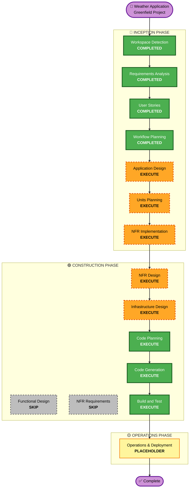

# Execution Plan
**Weather Application - AI-DLC Workflow Planning**

**Date**: 2026-09-24  
**Project Type**: Greenfield (New Development)  
**Analysis Phase**: INCEPTION - Workflow Planning Complete

---

## Detailed Analysis Summary

### Project Scope Overview
- **Project**: Weather Application
- **Scope Type**: Greenfield (building from scratch)
- **Primary Deliverable**: Bilingual (EN/VI) weather application with real-time alerts, forecasts, and offline capability
- **Target Users**: 2 personas (Alex - quick checker, Sam - detailed planner)
- **User Stories**: 24 stories organized into 3 implementation sprints
- **Technology Stack**: 
  - Frontend: HTML5/CSS3/JavaScript ES6+, Bootstrap 5, Chart.js
  - Backend: Node.js + Express.js
  - Database: PostgreSQL (Neon managed service)
  - Deployment: Vercel (serverless)
  - Source: GitHub
  - Client-side: localStorage, Service Workers (offline)

### Change Impact Assessment

#### User-Facing Changes: YES
- New weather application with search, current conditions, alerts, historical data, forecasts
- Multi-city favorites dashboard with quick comparison
- Real-time alert system (cold, heat, wind, humidity)
- Offline capability for cached data access
- 7-day historical trends and 5-day forecasts

#### Structural Changes: YES
- New application architecture with frontend/backend separation
- Multiple service layers:
  - Weather data fetching service
  - Alert evaluation system
  - Offline data caching layer
  - Real-time update mechanism

#### Data Model Changes: YES
- New data structures:
  - User preferences (favorites, language)
  - Weather cache (current, historical, forecast)
  - Alert thresholds and states
  - Auto-update timestamps

#### API Changes: YES
- New REST API endpoints for:
  - Current weather query
  - Forecast retrieval
  - Historical data access
  - Alert management
- Integration with third-party weather API (OpenWeatherMap or equivalent)

#### NFR Impact: YES - CRITICAL
- **Performance**: Must load in < 3 seconds (requirement)
- **Offline**: Service Worker caching required
- **Compatibility**: IE11+ support needed
- **Accessibility**: WCAG 2.1 AA compliance
- **Internationalization**: Dynamic EN/VI language switching
- **Security**: No authentication, localStorage-based persistence, API key management

### Component Relationships (Greenfield Architecture)

```markdown
## Primary Architecture Components

### Frontend Layer
- **Main Application**: Web-based UI (HTML/CSS/JavaScript)
- **UI Framework**: Bootstrap 5 (styling, responsiveness)
- **Chart Library**: Chart.js (7-day trends, data visualization)
- **State Management**: localStorage (client-side persistence)
- **Offline Support**: Service Worker (caching, offline mode)
- **Internationalization**: Custom JSON i18n system (EN/VI)

### Backend/API Layer
- **Framework**: Node.js + Express.js
- **Primary Functions**:
  - Weather data aggregation
  - Alert calculation and management
  - Data caching/optimization
  - API request routing
- **External Dependencies**: OpenWeatherMap API (or equivalent)

### Data Layer
- **Database**: PostgreSQL (Neon)
- **Purpose**: 
  - Store historical weather data
  - Cache forecast data
  - Persist user preferences
- **Data Models**:
  - weather_readings (timestamp, location, temp, humidity, wind, conditions)
  - forecasts (location, date_range, predictions)
  - user_preferences (favorites, language, alert_thresholds)

### Infrastructure Layer
- **Deployment**: Vercel (serverless)
- **Source Control**: GitHub
- **Database**: Neon (managed PostgreSQL)
- **API Integration**: Weather service endpoint

### Supporting Components
- **Monitoring**: Client-side error tracking, performance metrics
- **Caching**: Browser cache (Service Worker), database query cache
- **Testing**: Unit tests for API, integration tests for workflows
```

### Component Dependency Analysis

| Component | Type | Dependency | Impact | Priority |
|-----------|------|----------|--------|----------|
| Frontend UI | Core | Bootstrap 5 | High | Critical |
| Frontend UI | Core | Chart.js | Medium | Important |
| Frontend UI | Core | localStorage API | High | Critical |
| Frontend UI | Core | Service Worker API | High | Critical |
| Backend API | Core | Express.js | High | Critical |
| Backend API | Core | PostgreSQL driver | High | Critical |
| Backend API | External | Weather API | High | Critical |
| Database | Core | PostgreSQL/Neon | High | Critical |
| Offline | Core | Service Worker | High | Critical |
| Multilingual | Feature | i18n system | Medium | Important |
| Alerts | Feature | Threshold rules | Medium | Important |
| Auto-update | Feature | Event scheduling | Medium | Important |

### Risk Assessment

#### Risk Level: **MEDIUM**

**Rationale**:
- Greenfield project with clear requirements and established technology stack
- Well-defined scope with 24 bounded user stories
- Multiple concurrent development streams (frontend, backend, database)
- External API dependency (weather data source)
- Offline-first architecture adds implementation complexity
- Browser compatibility requirement (IE11+) may require polyfills

#### Risk Factors by Category

| Category | Risk | Mitigation |
|----------|------|-----------|
| **Scope** | Low | 24 stories with acceptance criteria, clear personas |
| **Technology** | Low-Medium | Established tech stack, community support |
| **Integration** | Medium | External API dependency, requires fallback handling |
| **Performance** | Medium | <3 sec load requirement, requires optimization |
| **Offline** | Medium | Service Worker complexity, cache invalidation strategy |
| **Browser Compat** | Medium | IE11 support needs testing, polyfills may be needed |
| **Data Persistence** | Low | localStorage well-understood, clear data model |
| **Deployment** | Low | Vercel/GitHub mature platforms |

#### Rollback Complexity: **MODERATE**
- Frontend changes are low-risk (client-side, fast rollback)
- Backend API changes manageable with version control
- Database schema changes require migration planning
- Overall: Can rollback features independently

#### Testing Complexity: **MODERATE**
- Unit testing: API logic, alert calculations, data transformations
- Integration testing: Frontend↔Backend, API↔Weather service, offline sync
- E2E testing: User journeys, alert scenarios, offline transitions
- Cross-browser testing: IE11, Chrome, Firefox, Safari

---

## Phase Determination Analysis

### 3.1 User Stories - Status: ✅ COMPLETED
Already executed with 24 comprehensive stories across 3 implementation sprints.

### 3.2 Application Design - Status: **EXECUTE**

**Decision**: EXECUTE this phase

**Rationale**:
✅ Multiple new components needed:
   - Frontend UI components (search, favorites, alerts, charts, forecast)
   - Backend API services (weather data, alerts, cache)
   - Offline persistence layer
   - Real-time update system

✅ Component methods and business rules need definition:
   - Alert calculation logic (cold < 0°C, heat > 35°C, wind > 30 km/h, humidity > 80%)
   - Data caching strategies
   - Update frequency (30 minutes)
   - Fallback behavior for API failures

✅ Service layer design required:
   - Weather fetching service
   - Alert evaluation service
   - Offline data sync service
   - Auto-update scheduler

✅ Component dependencies need clarification:
   - Frontend ↔ Backend API contracts
   - localStorage ↔ Database sync
   - Service Worker ↔ Cache invalidation
   - Language system ↔ Component rendering

**Artifacts to Create**:
- Component architecture diagram
- Service layer design
- API contract specification
- Data flow diagrams
- Offline sync strategy

---

### 3.3 Units Planning/Generation (Design) - Status: **EXECUTE**

**Decision**: EXECUTE this phase

**Rationale**:
✅ Multiple packages require creation:
   - Frontend package (HTML, CSS, JavaScript modules)
   - Backend package (Node.js API server)
   - Database package (PostgreSQL schema, migrations)
   - Utility packages (i18n, alert rules, data transformers)

✅ Infrastructure-as-code updates needed:
   - Vercel deployment configuration
   - Database schema and migrations
   - GitHub repository setup
   - Environment variables configuration

✅ Complex algorithms and business logic:
   - Alert threshold evaluation
   - Data caching invalidation strategy
   - Offline-online sync mechanism
   - Real-time update scheduling
   - Chart.js data transformation for visualization

✅ State management design:
   - localStorage structure for client persistence
   - Database schema for server-side persistence
   - Cache invalidation strategy
   - Favorites and preferences structure

**Artifacts to Create**:
- Units planning document (breakdown of implementation units)
- Database schema design
- API endpoint specifications
- Frontend component structure
- Service Worker strategy document
- Deployment configuration templates

---

### 3.4 NFR Implementation - Status: **EXECUTE**

**Decision**: EXECUTE this phase

**Rationale**:
✅ Performance requirements (CRITICAL):
   - Load time < 3 seconds (core requirement)
   - Requires: asset optimization, lazy loading, efficient data fetching
   - Chart.js performance tuning for 7-day data visualization

✅ Security considerations:
   - Third-party API key management
   - localStorage data scope (no sensitive info)
   - API rate limiting
   - Input validation for city search

✅ Scalability concerns:
   - Database query optimization for historical data
   - API caching strategy
   - Service Worker cache limits
   - Multiple concurrent user support

✅ Monitoring/observability needed:
   - Client-side error tracking
   - Performance metrics (load time, API response)
   - Offline usage tracking
   - Feature usage analytics

**Artifacts to Create**:
- Performance optimization strategy
- Caching strategy document (browser, database, API)
- Security implementation guide
- Monitoring and observability design
- Load testing plan

---

### 3.5 Functional Design (CONSTRUCTION) - Status: **SKIP**

**Decision**: SKIP

**Rationale**:
- Application Design phase will define all functional requirements
- User stories provide sufficient functional detail (24 stories with acceptance criteria)
- Service layer design (part of Application Design) covers functional workflows
- No benefit to separate Functional Design phase for greenfield project of this scope

---

### 3.6 NFR Requirements (CONSTRUCTION) - Status: **SKIP**

**Decision**: SKIP (covered by Application Design)

**Rationale**:
- NFR Implementation phase (INCEPTION) handles all NFR analysis and strategy
- Requirements document already specifies all NFR targets (performance, compatibility, accessibility)
- Separate NFR Requirements phase not needed at this project's scope
- NFR Design will follow directly from Application Design

---

### 3.7 NFR Design (CONSTRUCTION) - Status: **EXECUTE**

**Decision**: EXECUTE

**Rationale**:
- Critical performance requirements (< 3 sec load time) need detailed design
- Offline implementation requires explicit design for Service Worker strategy
- Internationalization system design needed for dynamic language switching
- Browser compatibility strategy requires design (polyfills, fallbacks)
- Accessibility requirements (WCAG 2.1 AA) need implementation planning

**Artifacts to Create**:
- Performance optimization design (asset pipeline, lazy loading, caching)
- Offline-first architecture design (Service Worker, data sync)
- Internationalization system design
- Browser compatibility matrix and fallback strategies
- Accessibility implementation checklist

---

### 3.8 Infrastructure Design (CONSTRUCTION) - Status: **EXECUTE**

**Decision**: EXECUTE

**Rationale**:
- PostgreSQL database schema design required
- Vercel deployment configuration needed
- GitHub Actions CI/CD setup
- Environment variable management strategy
- Database migration strategy
- API request/response format specification

**Artifacts to Create**:
- Database schema design document
- ER diagram (weather_readings, forecasts, user_preferences)
- Vercel configuration files
- Environment variable specifications
- CI/CD pipeline design
- API specification document (OpenAPI/Swagger format)

---

### 3.9 Code Planning & Generation - Status: **ALWAYS EXECUTE**

**Decision**: EXECUTE (MANDATORY)

**Rationale**: Implementation phase for all 24 user stories across 3 sprints

---

### 3.10 Build and Test - Status: **ALWAYS EXECUTE**

**Decision**: EXECUTE (MANDATORY)

**Rationale**: Build, test, and verification of generated code

---

## Workflow Visualization



**Legend**:
- 🟢 **COMPLETED** (Green): Already executed phases
- 🟠 **EXECUTE** (Orange with dashed border): Conditional phases to execute
- ⚫ **SKIP** (Gray with dashed border): Phases to skip
- 🟡 **PLACEHOLDER** (Yellow): Future phases (Operations)

---

## Phases to Execute

### 🔵 INCEPTION PHASE (Remaining)

#### ✅ Application Design - EXECUTE
- **Rationale**: Multiple new components require architectural definition, service layer design, and API contracts
- **Key Deliverables**: Component architecture, service layer specs, data flow diagrams
- **Effort**: Medium (2-3 days planning)
- **Dependencies**: Completed user stories and requirements

#### ✅ Units Planning - EXECUTE  
- **Rationale**: Multiple packages (frontend, backend, database) and complex algorithms require detailed planning
- **Key Deliverables**: Unit breakdown, database schema, API specs, component structure
- **Effort**: Medium (2-3 days planning)
- **Dependencies**: Completed Application Design

#### ✅ NFR Implementation - EXECUTE
- **Rationale**: Performance, offline, security, and accessibility requirements need comprehensive strategy
- **Key Deliverables**: Performance optimization plan, offline strategy, i18n design, compatibility matrix
- **Effort**: Medium (2-3 days planning)
- **Dependencies**: Completed requirements and user stories

---

### 🟢 CONSTRUCTION PHASE

#### ⏭️ Functional Design - SKIP
- **Rationale**: User stories provide sufficient functional detail; Application Design covers functionality
- **Rationale**: No benefit from separate phase for this project scope
- **Impact**: No delay; functionality captured in Application Design + User Stories

#### ⏭️ NFR Requirements - SKIP
- **Rationale**: NFR Implementation (INCEPTION) handles all NFR analysis
- **Rationale**: Requirements document already specifies all NFR targets
- **Impact**: Streamlines process without losing NFR rigor

#### ✅ NFR Design - EXECUTE
- **Rationale**: Performance, offline, accessibility, and multilingual features require detailed implementation design
- **Key Deliverables**: Performance design, offline architecture, i18n implementation, browser compatibility specs
- **Effort**: Medium (2-3 days design)
- **Dependencies**: Completed NFR Implementation phase

#### ✅ Infrastructure Design - EXECUTE
- **Rationale**: PostgreSQL schema, Vercel config, CI/CD, and API specifications need detailed design
- **Key Deliverables**: Database schema with ER diagram, API specification, deployment config, migration strategy
- **Effort**: Medium (2-3 days design)
- **Dependencies**: Completed Units Planning

#### ✅ Code Planning - EXECUTE (ALWAYS)
- **Rationale**: Implementation approach needed for 24 user stories across 3 sprints
- **Key Deliverables**: Development plan, sprint breakdown, story implementation order
- **Effort**: Medium (1-2 days planning)
- **Dependencies**: Completed design phases

#### ✅ Code Generation - EXECUTE (ALWAYS)
- **Rationale**: Implement all 24 user stories
- **Key Deliverables**: Complete frontend (HTML/CSS/JS), backend API (Node/Express), database (PostgreSQL), deployment config
- **Effort**: High (7-10 days development)
- **Dependencies**: Completed Code Planning

#### ✅ Build and Test - EXECUTE (ALWAYS)
- **Rationale**: Build, test, and verification of complete application
- **Key Deliverables**: Working application, test suite, deployment verified
- **Effort**: Medium (3-5 days testing + deployment)
- **Dependencies**: Completed Code Generation

---

## Implementation Sprint Breakdown

### Sprint 1: Core Weather Functionality (MVP)
- **Stories**: WS-101 to WS-105, WF-201 to WF-204, WU-601 (basic refresh)
- **Duration**: 2-3 days
- **Deliverables**: Search weather, current conditions, favorites management, basic auto-refresh
- **Focus**: Alex persona requirements (quick weather check)

### Sprint 2: Alerts and Offline Support
- **Stories**: WA-301 to WA-305, WO-701 to WO-704, WU-602 to WU-604
- **Duration**: 2-3 days
- **Deliverables**: Alert system (cold/heat/wind/humidity), offline capability, loading indicators
- **Focus**: Both personas' alert awareness and offline needs

### Sprint 3: Advanced Features and Polish
- **Stories**: WH-401 to WH-404, WF-501 to WF-503, WI-801 to WI-804
- **Duration**: 2-3 days
- **Deliverables**: Historical trends (7-day chart), forecasts (5-day view), multilingual support (EN/VI)
- **Focus**: Sam persona detailed planning needs and internationalization

---

## Estimated Timeline

| Phase | Est. Duration | Critical Path? |
|-------|---|---|
| Application Design | 2-3 days | YES |
| Units Planning | 2-3 days | YES |
| NFR Implementation | 2-3 days | YES |
| **INCEPTION TOTAL** | **6-9 days** | - |
| NFR Design | 2-3 days | YES |
| Infrastructure Design | 2-3 days | YES |
| Code Planning | 1-2 days | YES |
| Code Generation (3 sprints) | 7-10 days | YES |
| Build & Test | 3-5 days | YES |
| **CONSTRUCTION TOTAL** | **15-23 days** | - |
| **PROJECT TOTAL** | **21-32 days** | - |

**Estimated Project Delivery**: 3-4 weeks (accounting for parallel work on design/infrastructure)

---

## Success Criteria

### Primary Goal
Deliver a production-ready Weather Application meeting all 24 user story acceptance criteria with offline capability, multilingual support, and performance optimization.

### Key Deliverables

**Inception Phase**:
- ✅ Component architecture and service layer design
- ✅ Database schema and API specifications
- ✅ NFR implementation strategy (performance, offline, accessibility, internationalization)
- ✅ Detailed code plan with sprint breakdown

**Construction Phase**:
- ✅ Complete frontend implementation (HTML/CSS/JavaScript)
- ✅ Complete backend API (Node.js/Express)
- ✅ Database schema and migrations (PostgreSQL)
- ✅ Service Worker implementation (offline support)
- ✅ Internationalization system (EN/VI)
- ✅ Alert system implementation
- ✅ Data visualization (7-day trends, 5-day forecast)
- ✅ Deployment configuration (Vercel, GitHub)

**Quality Gates**:
- ✅ All 24 user stories pass acceptance criteria
- ✅ Load time < 3 seconds (performance requirement)
- ✅ Offline functionality tested and verified
- ✅ Browser compatibility verified (Chrome, Firefox, Safari, IE11)
- ✅ Accessibility compliance (WCAG 2.1 AA)
- ✅ Alert system accuracy (threshold-based notifications)
- ✅ API reliability (error handling, rate limiting)
- ✅ Database schema normalized and indexed
- ✅ CI/CD pipeline working (GitHub Actions, Vercel auto-deploy)

### Integration & Operations
- ✅ Monitoring setup (error tracking, performance metrics)
- ✅ Offline sync validation
- ✅ Real-time update mechanism tested
- ✅ Multi-user concurrent access verified
- ✅ Data persistence verified across sessions

---

## Next Steps

### ✅ IF APPROVED
Proceed to Application Design phase:
1. Create component architecture diagram
2. Define service layer design
3. Specify API contracts
4. Design data flow diagrams
5. Document offline sync strategy

### 🔧 IF CHANGES REQUESTED
Update execution plan and resubmit for approval

### 📝 IF ADDING SKIPPED STAGES
Clarify why and integrate into plan

---

**Document Status**: ✅ EXECUTION PLAN COMPLETE

**Ready for**: User Review and Approval to Proceed to Application Design Phase

